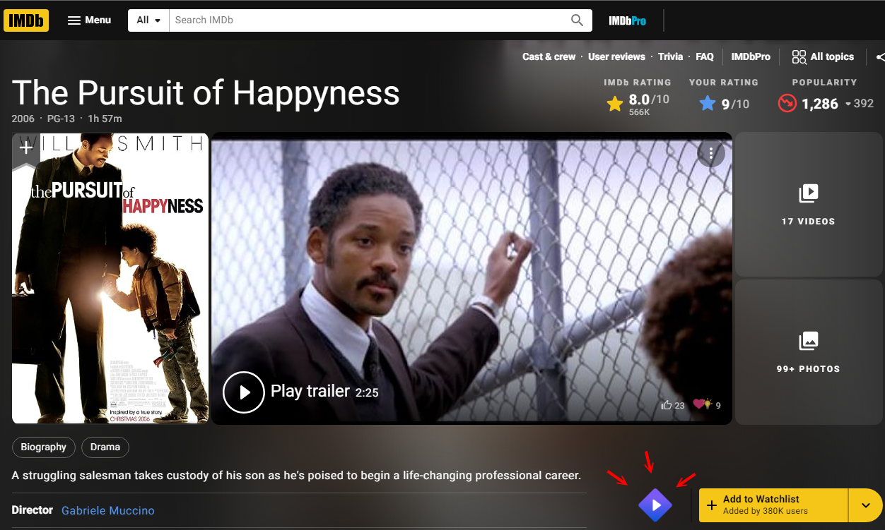
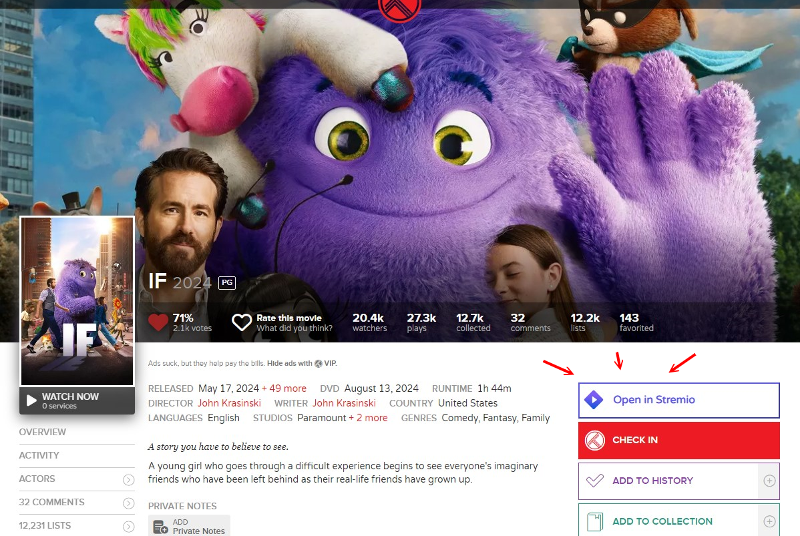
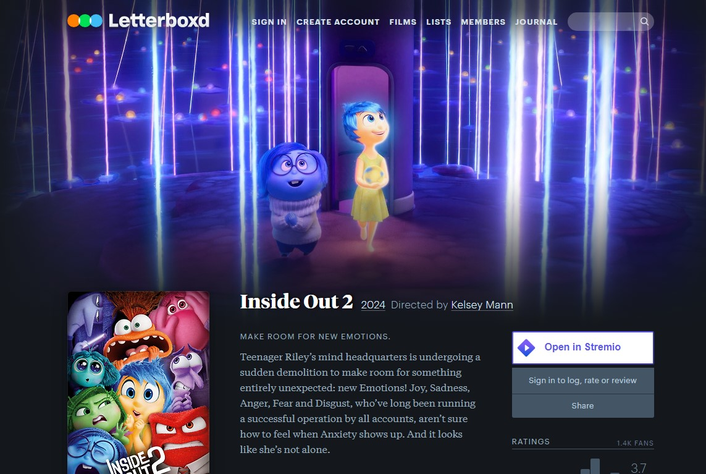
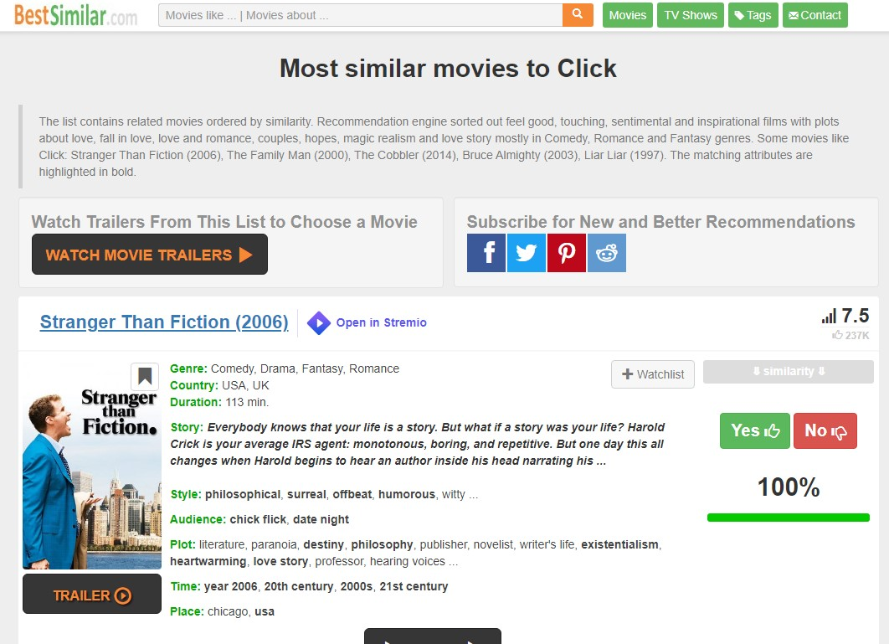
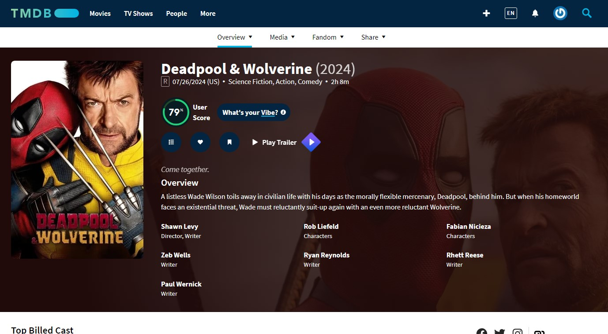

# IMDB \ Trakt Open in Stremio

## Purpose

Help you open Stremio movies or shows directly from IMDB, Trakt and other sites.

## What it does

Add a Stremio button to various sites. The button opens the movie\series page on Stremio.
On some sites, there's an export button that export list to be used on [journey.co.il/stremio/](https://www.journey.co.il/stremio) in order to create a catalog.

The plugin works on Chrome and on Firefox

## Which sites are supported?

- IMDB (+ option to download advanced search results as a CSV list)
- Trakt
- letterboxd
- Rotten Tomatoes (Search only)
- Bestsimilar (+ option to download movies as a CSV list)
- TMDB
- Reddit (r/MovieSuggestions and r/televisionsuggestions) creating lists only
- douban

## Installation

[Download the extension](https://github.com/yortem/chrome-stremio-imdb/releases/) for your favorite browser. Unzip the contents and then follow the instructions below.

### Chromium-based browsers (Chrome, Edge, Brave)

- Go to chrome://extensions/
- Make sure "Developer Mode" is enabled on the top corner of the page
- Click on "Load unpacked" 
- Select the folder you just unzipped
- See a new button on IMDB \ Trakt pages of movies and shows

### Firefox
- Go to "about:debugging" in the url bar 
- Click on "This Firefox"
- Click on "Load Temporary Add-on"
- Choose the file "manifest.json"
- On the first visit to IMDB or Trakt, click on the extensions icon and then near this extension, mark it as "always allow on imdb" or trakt
- * Since it's a temporary addon, it will mean the addon will be removed once you close your browser. that's a temporary solution until hopefuly it will be an official addon.

## Screenshots








## Development

First of all, you need to have [Node.js](https://nodejs.org/) installed on your system.

To test the extension during development, load the extension as an unpacked extension in your browser.

Alternatively, you can build the extensions for all browsers and then load the extension from the `dist` directory. To do so, install the development dependencies first:

```bash
$ npm install
```

Then, run:

```bash
$ npm run build
```

This will create a `dist` directory with the built extensions. You can then load the extension following the [installation instructions](#installation) above.

---

This is an unofficial chrome extension of neither IMDB \ Trakt \ Stremio.

To discuss the extension, go to this [post on reddit](https://www.reddit.com/r/StremioAddons/comments/1dtvjmk/chrome_extension_open_the_movie_in_stremio/)
