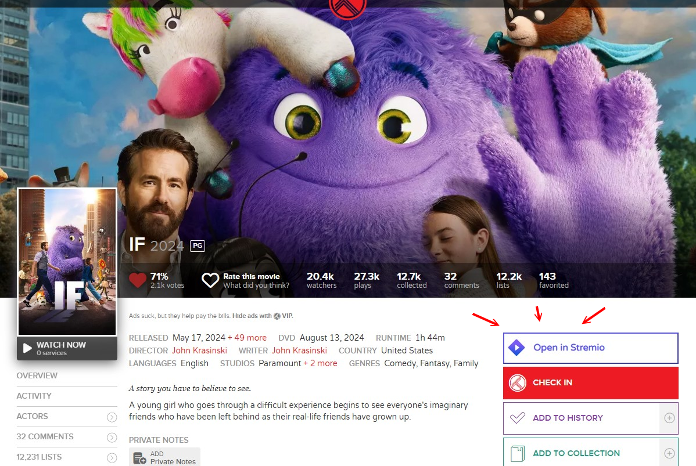

# IMDB \ Trakt Open in Stremio

## Purpose

Help you open stremio movies directly from IMDB or Trakt.

## What it does

Add a button to the IMDB\Trakt page of movies and TV shows, next to the Wishlist button. The button opens the movie page on Stremio.

## How to install

- Download this repository as zip
- Unzip the content to any folder
- Go to chrome://extensions/
- Make sure "Developer Mode" is enabled on the top corner of the page
-  Click on "Load unpacked" 
- Select the folder you just unzipped
- See a new button on IMDB pages of movies and shows

This is an unofficial chrome extension of neither IMDB \ Stremio